# Warehouse Robotics and Reinforcement Learning Sandbox

<p align="center">
  
</p>

<p align="center">
  A compact reinforcement learning project built around custom environments, tabular control, environment rendering, and reward design.
</p>

## Overview

This repository explores how simple agents learn under different environment dynamics, observation designs, and reward structures.

The work is split across two self-contained RL problems:

- A custom warehouse robot environment where an agent navigates a grid, avoids shelves, picks up boxes, and delivers them to a goal state.
- A stock-trading environment built on historical NVDA data, where an agent learns buy, sell, and hold policies from compact market-state signals.

What makes the project interesting is not just training an agent, but designing the full loop around it: state representation, environment mechanics, stochasticity, reward shaping, persistence of learned policies, and evaluation through plots and rollouts.

The strongest part of the project is the environment work itself. Instead of dropping an agent into a standard benchmark, I built a task from scratch, decided what the agent should observe, defined the action semantics, shaped the incentives, and then increased the difficulty by modifying the world dynamics and state space.

## What’s Inside

| Area | What it does |
| --- | --- |
| `Bonus.ipynb` | Warehouse environment, deterministic and stochastic dynamics, Q-learning training, reward tracking, and multi-box extension |
| `A1_Part-3.ipynb` | Stock-trading environment over `NVDA.csv`, tabular Q-learning agent, training and evaluation plots |
| `Images/` | Environment sprites used to render the warehouse world |
| `*.pickle` | Saved Q-tables and training artifacts for reproducible evaluation |

## Project Highlights

### 1. Custom Warehouse RL Environment

The warehouse task is implemented as a custom Gym/Gymnasium-style environment and is the core of the project.

I treated the environment design as a systems problem, not just a coding exercise:

- The world is a `6 x 6` warehouse grid with a fixed start position, fixed goal position, and shelf cells that act as obstacles.
- The agent has six actions: move `up`, `down`, `left`, `right`, `pick-up`, and `drop-off`.
- Episode length is capped, which forces the policy to care about efficiency instead of wandering.
- The reward function combines a per-step penalty, obstacle penalties, pickup rewards, and a large terminal reward for successful delivery.
- The same task can be run in deterministic mode or in a stochastic mode where the intended action is ignored 10% of the time.
- Rendering is built directly into the environment using sprite composition, which makes policy debugging much easier than reading raw tuples.

That combination matters because it turns the problem from simple pathfinding into an actual decision process with invalid moves, delayed rewards, and noisy execution.

<p align="center">
  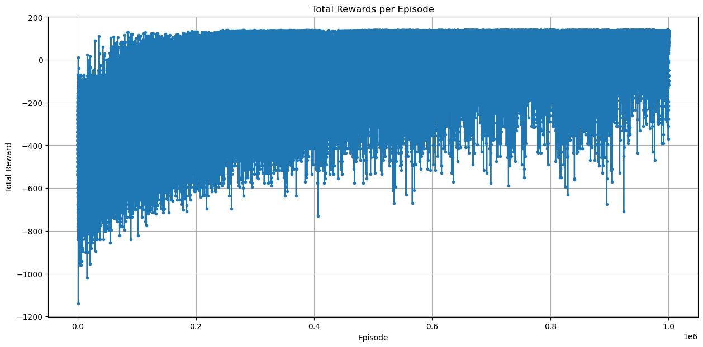
  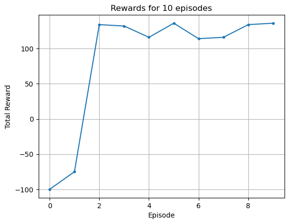
</p>

### 2. Environment Scaling and Bonus Variant

After getting the base warehouse setup working, I made the environment meaningfully harder rather than just retraining the same task.

The bonus version increases complexity in a few important ways:

- Two boxes spawn at random non-reserved cells instead of a single fixed object.
- The state now has to track the agent position, both box positions, and whether the agent is carrying one or two boxes.
- The agent must reason about collection order, transport, and delivery under a larger state space.
- The same shelves, terminal goal, action set, and reward logic still apply, so the difficulty comes from environment design rather than changing the learning algorithm.

This is the kind of extension I wanted from the project: same learning framework, richer world model, harder coordination problem.

<p align="center">
  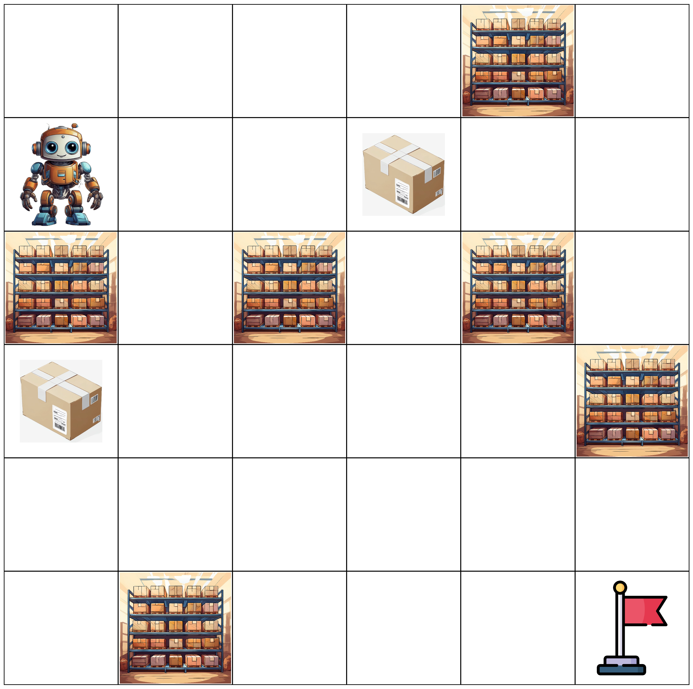
  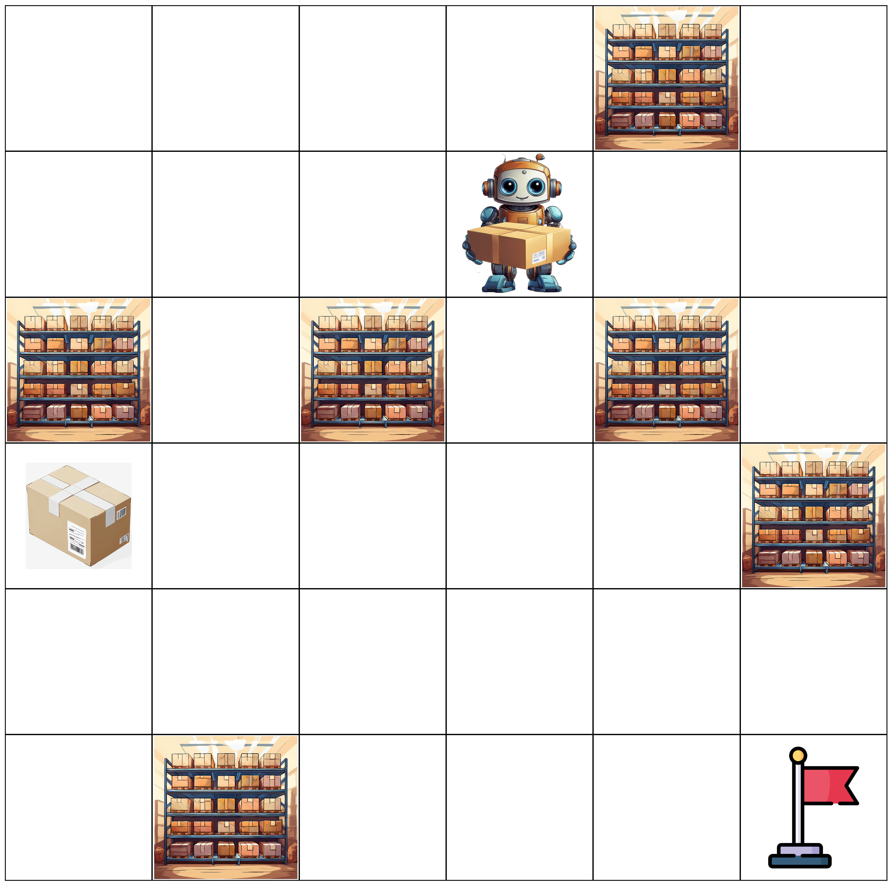
  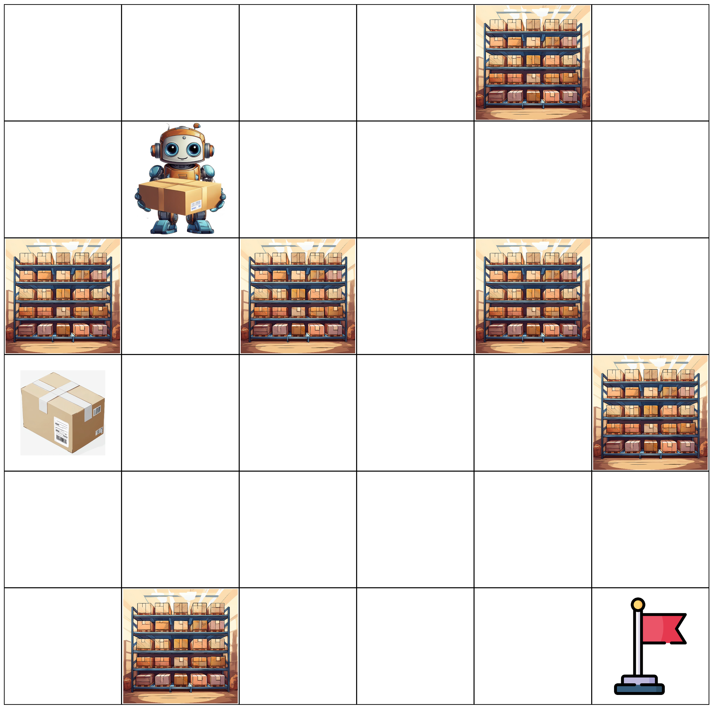
</p>

<p align="center">
  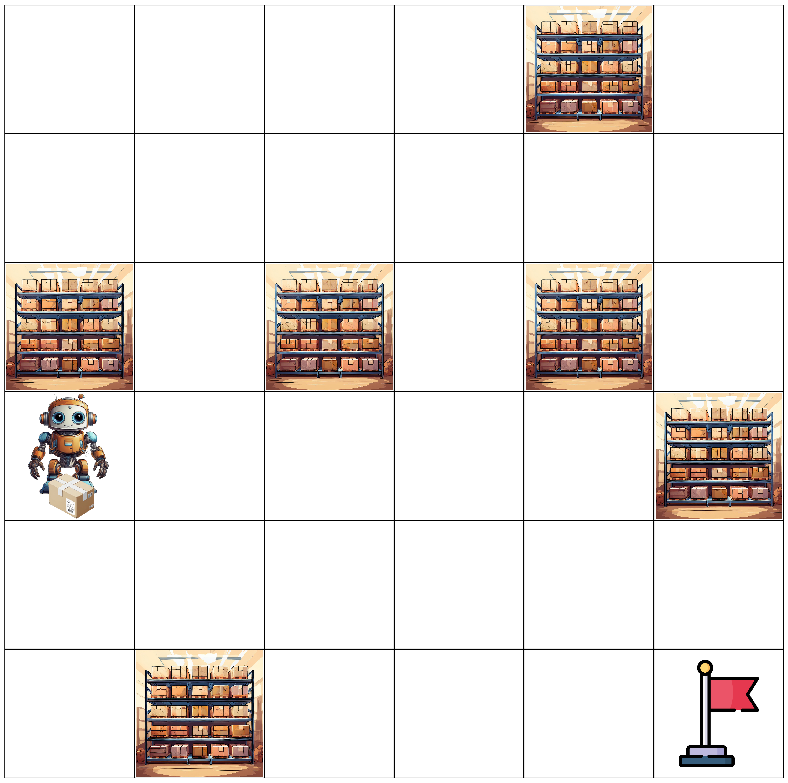
  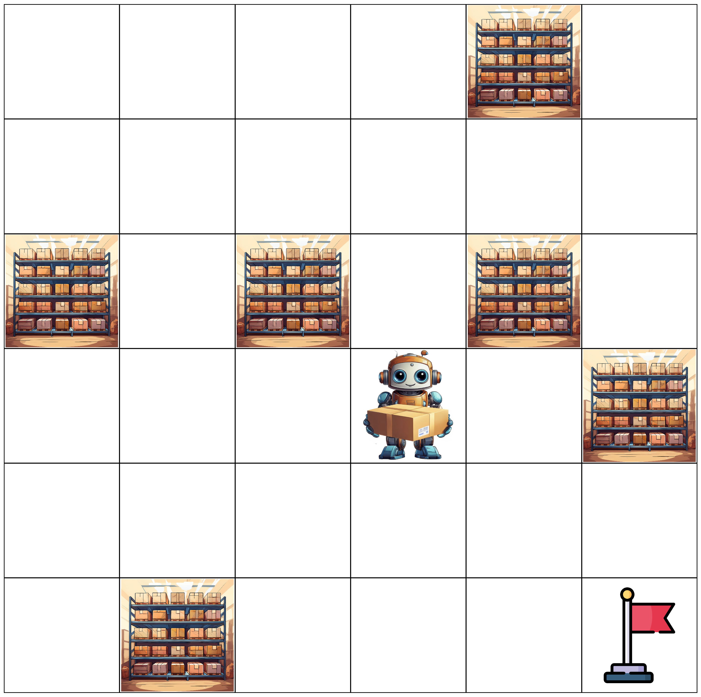
  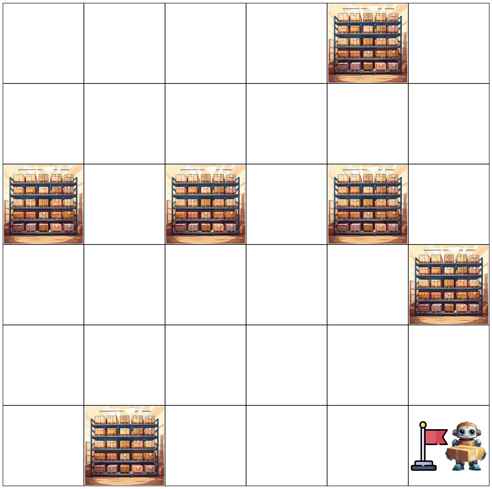
</p>

<p align="center">
  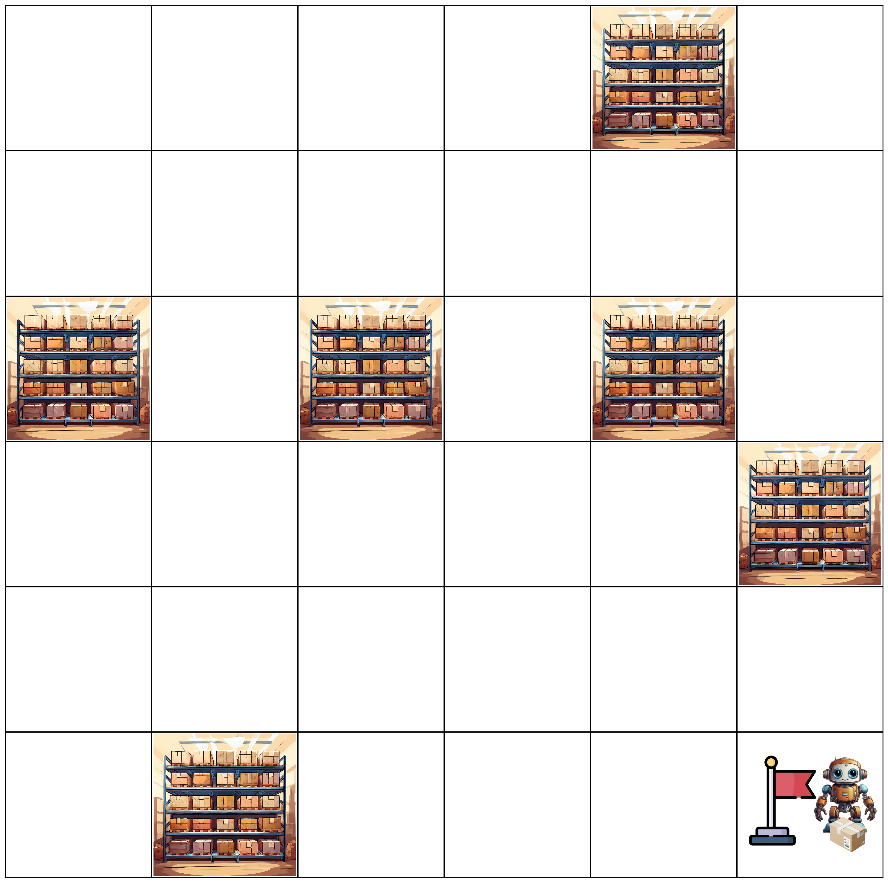
</p>

The sequence above is a solved rollout from the harder two-box environment. It shows the agent starting from the initial state, navigating around shelf obstacles, collecting boxes, and finishing at the goal with the task completed.

### 3. Tabular Q-Learning Under Changing Dynamics

The warehouse experiments focus on how a tabular learner behaves when the environment becomes less forgiving:

- Baseline Q-learning on the warehouse task
- Deterministic vs. stochastic action outcomes
- Persistent Q-table checkpoints saved during training
- A larger state space in the two-box variant

Even with simple tabular methods, the project surfaces the real engineering challenge in RL: getting the environment and reward incentives aligned well enough that the learned behavior is meaningful.

### 4. Stock-Trading Environment from Real Price Data

The second environment reframes RL around sequential decision-making on market data:

- Historical NVDA prices loaded from `NVDA.csv`
- Train/test split built directly into the environment
- Observation state based on short-window trend direction and whether the agent is already holding stock
- Actions: buy, sell, hold
- Account-value tracking across time for training and test evaluation

The reward function penalizes invalid actions, encourages profitable exits, and tracks portfolio value over time rather than treating each step in isolation.

<p align="center">
  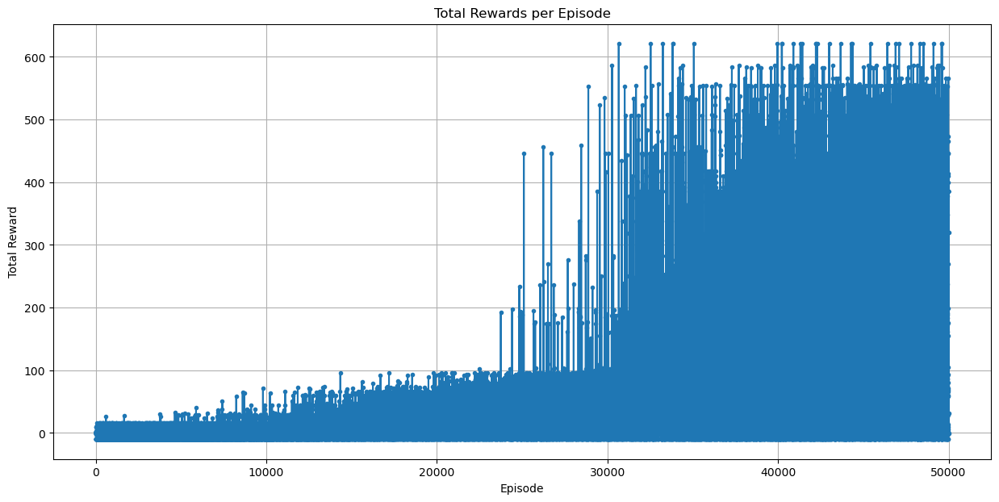
  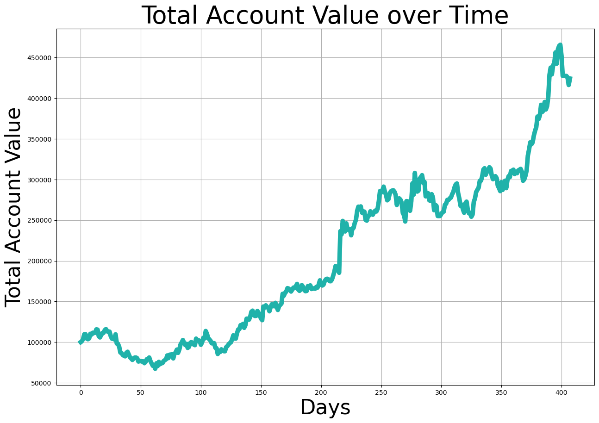
</p>

<p align="center">
  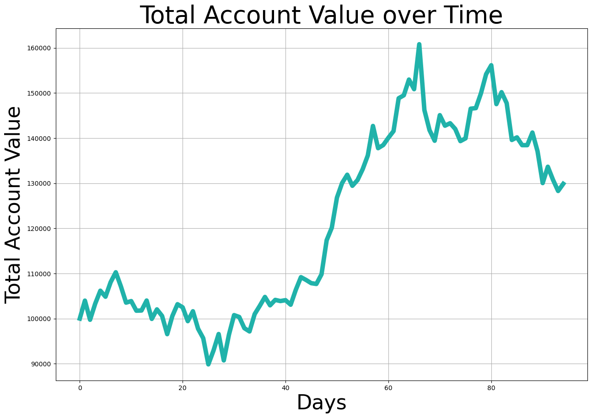
</p>

## Technical Notes

- Environment interfaces follow the Gym/Gymnasium pattern with `reset`, `step`, and `render`.
- Learned policies are serialized as pickle files for quick reuse and inspection.
- The warehouse renderer uses Matplotlib image overlays to visualize composite states such as robot-plus-box or goal-plus-box.
- The bonus warehouse state explicitly expands to include multiple object locations and carrying flags, which is where the tabular state space becomes much more interesting.
- The stock environment compresses recent price movement into a compact discrete state, which makes tabular learning tractable while still preserving useful signal.

## Why This Project Was Worth Building

This repository was a chance to work on more than just an RL algorithm in isolation. It involved:

- Designing environments instead of only consuming benchmark ones
- Choosing state abstractions carefully enough for tabular methods to work
- Building evaluation views that make failures visible
- Comparing agent behavior across deterministic and stochastic worlds
- Extending a base environment into a more difficult variant without changing the core learning setup

That combination of environment design, experimentation, and practical debugging is what made this project especially fun to build.

## Running the Project

The main artifacts are notebook-based:

```bash
jupyter notebook Bonus.ipynb
jupyter notebook A1_Part-3.ipynb
```

If you want to inspect learned policies directly, the saved `*.pickle` files can be loaded from the notebooks.

## Repository Snapshot

```text
.
├── Bonus.ipynb
├── A1_Part-3.ipynb
├── NVDA.csv
├── Images/
├── README_assets/
└── *.pickle
```

## Author

Phani Tarun M
